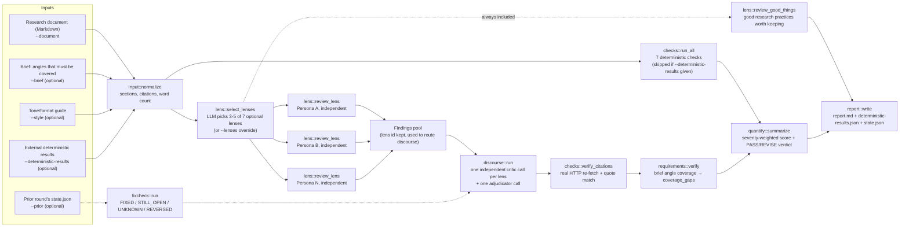
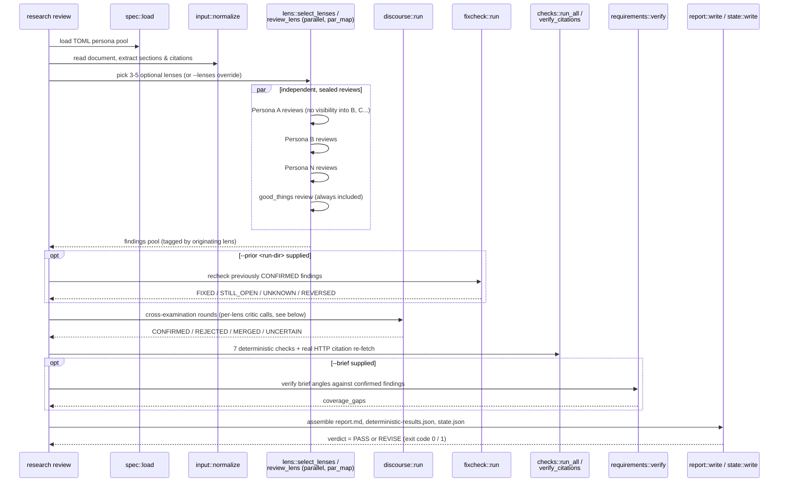
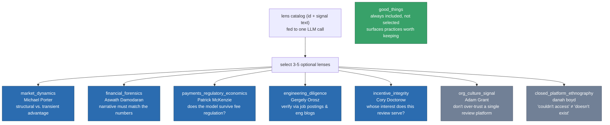
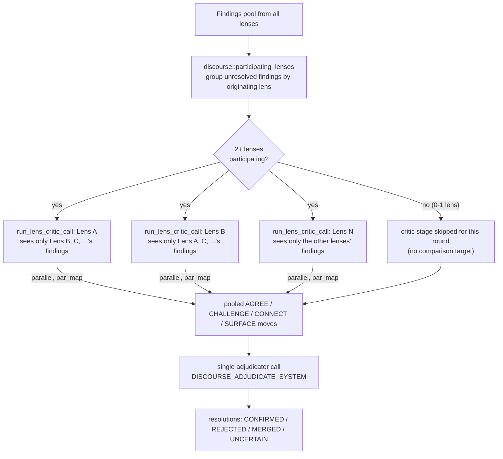
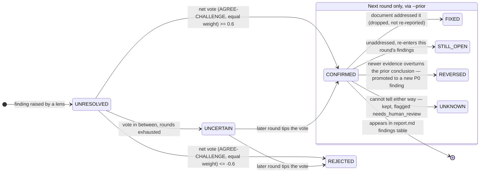
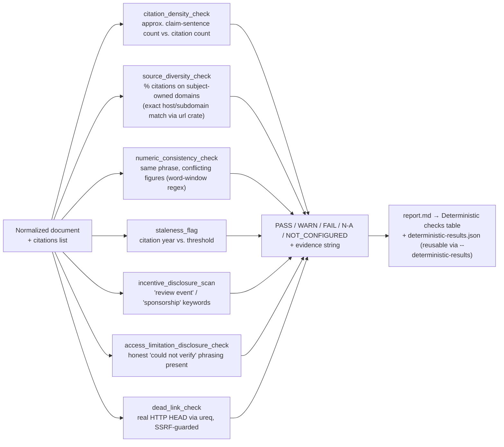
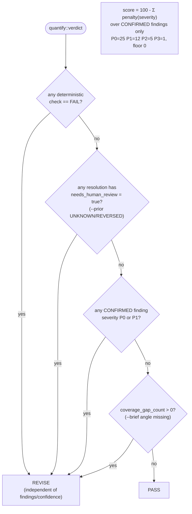

# research-loop

[](LICENSE)

A Rust CLI that validates market/competitor research documents through **independent multi-persona review → per-lens independent discourse cross-examination → deterministic verdict**, instead of trusting a single LLM's pass over the text.

This is a working, buildable binary (`cargo build --release` produces `target/release/research`), not just a design document — it has been run end-to-end against a real research document (see [Validated on a real document](#validated-on-a-real-document) below). It is also still under active hardening: of the issues opened against its own design, 11 are closed and 1 remains open (tracked below in [Known limitations](#known-limitations)).

The default LLM backend is a `claude -p` subprocess (Claude Code CLI) — no separate API key required. An OpenRouter backend is also available (`--backend openrouter`, requires `OPENROUTER_API_KEY`, defaults to `openai/gpt-oss-120b` if `--model` is unset).

## Why this exists

This tool generalizes something that actually happened: across many rounds inside the MangroveCafeOrder project, a Korean café-POS competitor research document was researched, drafted, re-researched, and corrected over and over. That repeated cycle surfaced concrete failure modes that a single-pass research pipeline does not catch on its own:

- **Quantitative vs. qualitative signals disagreeing** — PayHere's app-store rating looked fine (4.0 / 245 reviews) while long-form reviews on Clien were scathing; Jobplanet (2.7) and Blind (3.5) disagreed by 0.8 points on the same employer.
- **A subject's own marketing content dominating search results** — searching "카페 포스기 추천" (café POS recommendation) surfaced Toss Place's own blog series repeatedly, which could be miscited as independent coverage if not distinguished from marketing copy.
- **Paid/incentivized reviews contaminating credibility** — Toss Place was found to be running a "₩5,000 per review + ₩50,000 per referred install" cash program, meaning positive-sounding posts about it could not be taken at face value.
- **The same metric reappearing with different numbers across sources** — T-order's count of integrated POS terminals was cited as anywhere from "25" to "50+" depending on the source, and its reported revenue (₩58.7B in 2023 vs. ₩41.9B in 2025) looked like decline but was actually explained by an accounting-method change, not a shrinking business — indistinguishable without re-verification.
- **A prior conclusion getting reversed by newer evidence** — a T-order/KT relationship recorded as "acquisition talks rumored, unconfirmed" turned out, three months later, to be a public IP-dispute and restructuring story — the kind of reversal a document has to explicitly flag as *overturned*, not just updated.
- **Closed platforms getting silently skipped** — Korea's largest self-employed-business community runs on a login-gated Naver café that search engines don't index, so "could not verify" and "does not exist" need to stay distinguishable.

None of these are caught by asking one model to "review this document" once. research-loop encodes the fix as a repeatable pipeline instead of manual vigilance.

> Design rationale, stage-by-stage: **[docs/design-spec.md](docs/design-spec.md)**
> Evidence survey (competitive-intelligence tooling landscape, citation-hallucination-detection research, and a source-code-level re-verification of several open-source "deep research" agents): **[docs/research-and-evidence-survey-2026-07-31.md](docs/research-and-evidence-survey-2026-07-31.md)**

## Architecture at a glance



## Module map (`src/`)

```mermaid
flowchart TB
    MAIN["main.rs<br/>clap CLI, subcommand dispatch, par_map concurrency helper"]

    MAIN --> SPEC["spec.rs<br/>loads TOML lens pool, labels, thresholds"]
    MAIN --> INPUT["input.rs<br/>parses document/brief/style, extracts sections + citations"]
    MAIN --> LENS["lens.rs<br/>select_lenses, review_lens, review_good_things"]
    MAIN --> CHECKS["checks.rs<br/>7 deterministic checks, SSRF-guarded HTTP fetch, citation verification"]
    MAIN --> DISCOURSE["discourse.rs<br/>per-lens critic calls + adjudicator, resolution states"]
    MAIN --> FIXCHECK["fixcheck.rs<br/>--prior recheck of previously CONFIRMED findings"]
    MAIN --> REQ["requirements.rs<br/>brief angle coverage verification"]
    MAIN --> QUANTIFY["quantify.rs<br/>severity scoring + PASS/REVISE verdict"]
    MAIN --> REPORT["report.rs<br/>writes report.md / describe.md / improve.md / ask.md"]
    MAIN --> STATE["state.rs<br/>RunManifest: state.json for --prior chaining + audit"]
    MAIN --> DESCRIBE["describe.rs<br/>Describe subcommand"]
    MAIN --> IMPROVE["improve.rs<br/>Improve subcommand"]
    MAIN --> ASK["ask.rs<br/>Ask subcommand"]

    LENS --> PROMPTCTX["promptctx.rs<br/>shared prompt context + prompt-injection defenses"]
    DISCOURSE --> PROMPTCTX
    CHECKS --> PROMPTCTX
    REQ --> PROMPTCTX

    MAIN --> LLM["llm.rs<br/>Llm: claude-cli subprocess or OpenRouter REST, usage/cost tracking"]
    LENS -.calls.-> LLM
    DISCOURSE -.calls.-> LLM
    FIXCHECK -.calls.-> LLM
    REQ -.calls.-> LLM
```



## Requirements

- Rust 1.70+
- `claude` CLI installed and logged in (pass `--claude-bin` if it's not on `PATH`), or `OPENROUTER_API_KEY` if using `--backend openrouter`

## Build

```bash
cargo build --release   # binary at target/release/research
```

## Subcommands

```bash
# 1) Independent per-lens review + discourse cross-examination (the core pipeline)
research --model sonnet --cheap-model haiku review \
  --spec specs/default.toml --document my-research.md \
  --brief brief.md --out runs/pos --concurrency 4 --max-rounds 2

# 2) Summarize the document (key findings, labels, splittability) + scan for "needs verification" markers
research describe --spec specs/default.toml --document my-research.md --out runs/pos

# 3) Propose concrete revisions (things to re-research or correct)
research improve --spec specs/default.toml --document my-research.md --out runs/pos

# 4) Free-form Q&A grounded in the document, appended to ask.md
research ask --spec specs/default.toml --document my-research.md --out runs/pos \
  "Did this company obtain PCI-DSS certification?"
```

Selected `review` flags (see `src/main.rs` for the full `clap` definition): `--lenses` (comma-separated manual override, skips LLM lens selection), `--deterministic-results` (feed in externally computed check results instead of re-running `checks::run_all`), `--prior <run-dir>` (chain against a previous round's `state.json`), `--as-of-year` (staleness baseline; defaults to the highest 4-digit year found in the document), `--skip-link-check` (skip live HTTP checks for CI/offline use).

`review`'s exit code reflects the verdict, so it can be used as a CI gate: `PASS` → exit `0`, `REVISE` → exit `1` (Rust-level errors, e.g. a malformed spec, also exit `1`). `describe`/`improve`/`ask` always exit `0` on success — they don't produce a verdict.

## Execution flow of a `review` run



## Lens selection and the persona pool

Each lens is voiced by a real analyst/author to suppress sycophancy — the model is told *who* it is arguing as, not just given a topic. There is no `--research-type` flag: `lens::select_lenses` shows the LLM a catalog of each lens's `signal` (the kind of document it applies to) and asks it to freely pick 3-5 of the 7 optional lenses; an 8th lens, `good_things` (looks for research practices worth keeping), is always included and is not part of that selection.



## Discourse: independent critic per lens, then a single adjudicator

Discourse used to run as one central LLM call simulating every lens's rebuttals at once. It now runs as one independent critic call **per participating lens**, each shown only the *other* lenses' findings (never its own — a lens cannot review itself) and run in parallel via the same `par_map` concurrency helper used for the initial lens reviews. Their moves are then pooled and resolved by a single adjudicator call.



Every `AGREE`/`CHALLENGE` counts as weight 1.0 — the model's self-reported `confidence` (high/medium/low) is still recorded for the audit trail but no longer converts into a differentiated vote weight, since those weights were never calibrated against any ground truth (see [Known limitations](#known-limitations)). A valid `CHALLENGE` must re-measure the same metric via a different method or an independent source and find a discrepancy — "this feels outdated" with no counter-evidence is downgraded to `SURFACE` instead.

### Resolution lifecycle, including `--prior` re-checks



`REVERSED` is a research-loop addition with no equivalent in Code-Review-Loop's fixcheck — it exists specifically for the "prior conclusion overturned by newer evidence" failure mode (the T-order/KT example above). `STILL_OPEN`, `REVERSED`, and `UNKNOWN` all re-enter the current round's findings (`UNKNOWN` was previously dropped silently — fixed, see [Known limitations](#known-limitations)); only `FIXED` drops out.

## Deterministic checks (`checks.rs`)

Code-Review-Loop splits this into `policy.rs` + `semgrep.rs`. Research documents have no equivalent of an "auto-fill everything" scanner like semgrep, so there was no reason to keep two modules — they're merged into one.



| check | what it does |
|---|---|
| `citation_density_check` | approximate claim-sentence count (max of Korean sentence-ending particles vs. general punctuation heuristics) vs. citation count |
| `source_diversity_check` | share of citations whose URL host exactly matches (or is a subdomain of) a domain the research *subject* itself owns — parsed via the `url` crate, not substring matching |
| `numeric_consistency_check` | flags the same short phrase (2-4 words before a 억/조/원/%/명/개 unit) appearing with different numbers elsewhere in the document (heuristic, `WARN` only, never `FAIL`) |
| `staleness_flag` | flags citation years older than a configurable threshold relative to `--as-of-year` |
| `incentive_disclosure_scan` | flags "review event / sponsorship / cash reward" language for downstream discourse review |
| `access_limitation_disclosure_check` | checks the document actually says "could not verify" somewhere, rather than staying silent about access limits |
| `dead_link_check` | makes a real HTTP HEAD request (via `ureq`, through an SSRF-guarded fetch path that blocks loopback/private/link-local/metadata addresses) per citation URL; timeouts are `WARN`, not `FAIL`. Skippable with `--skip-link-check` |

Separately, `checks::verify_citations` re-fetches each cited URL (same SSRF-guarded path) after discourse and overwrites each finding's `citation_status` with `UNFETCHED` / `FETCH_FAILED` / `QUOTE_MATCHED` / `QUOTE_NOT_FOUND` based on whether the finding's `evidence` text is actually found (whitespace/case-normalized substring match) in the fetched page. The LLM's original self-reported status is preserved separately as `llm_citation_status` but no longer drives the report.

## Deterministic vs. LLM-judgment boundary

The verdict is designed so an LLM's opinion can never override "hard evidence" from the deterministic checks — `quantify::verdict` short-circuits to `REVISE` before it even looks at findings or confidence if any check has `FAIL`ed:



`score` (0-100) is reported alongside `verdict` but never itself decides `PASS`/`REVISE` — it exists to rank *how bad* a `REVISE`, or how clean a `PASS`, is.

## Validated on a real document

This was run against the research document that motivated it (MangroveCafeOrder's POS-competitor research):

- `describe` extracted key findings, sections, and "needs verification" markers from the document.
- `review` produced `verdict=PASS score=95/100`, and along the way `numeric_consistency_check` caught 8 conflicting figures behind the phrase "operating loss" (each figure was correct for a *different* company/round, but the check correctly flagged that they needed disambiguating) — and the discourse round surfaced an unverified secondary-source estimate that diverged from the company's own official figure, something a naive "most-repeated-number-wins" approach would have missed.

## It was checked against real open-source competitors, at the source-code level

The evidence survey didn't stop at README pages. Reading actual source files in `assafelovic/gpt-researcher`, `guy-hartstein/company-research-agent`, and `geekan/MetaGPT` corrected one of the survey's own earlier claims: GPT Researcher's README implies "most-frequent-info-wins" voting, but its actual `curator.py` does vector-similarity filtering plus a single LLM ranking pass — no contradiction detection either way. `company-research-agent` (LangGraph + Gemini 2.5 + GPT-5.1, solving the *same problem* as research-loop) turned out to be a strictly sequential 6-node pipeline with zero cross-validation anywhere in its source. Full writeup, including the self-correction: [docs/research-and-evidence-survey-2026-07-31.md §8](docs/research-and-evidence-survey-2026-07-31.md).

## Known limitations

Tracked as GitHub issues against this repo; 11 are closed, 1 remains open.

- **Open — confidence calibration (#3):** `confidence` (high/medium/low) is an uncalibrated self-report, not a measured accuracy rate. `discourse.rs` no longer converts it into a differentiated vote weight (it used to: high=1.0, medium=0.6, low=0.3) — those numbers were never validated against ground truth, so every `AGREE`/`CHALLENGE` now counts as weight 1.0 (plain majority vote) until a labeled benchmark exists to calibrate against.
- **Citation verification is a substring match, not entailment:** `checks::verify_citations` re-fetches each cited page and checks whether the finding's `evidence` text appears in it (closed #4) — but `QUOTE_MATCHED` means the exact wording was found on the page, not that the page's *meaning* supports the claim. Fully tool-augmented verification (re-fetch, extract the actual number, diff it against the document's claim) is not implemented.
- **`numeric_consistency_check` is a word-window regex,** not morphological/entity parsing — expect false positives/negatives. It stays `WARN`-only for exactly this reason.
- **`citation_density_check` is still a heuristic** (Korean sentence-ending particles vs. general punctuation, whichever counts more) after its false-positive fix (#5) — `source_diversity_check`, by contrast, now does exact host/subdomain matching via the `url` crate rather than substring matching.
- **Same-model bias risk:** if the generation model and the judge model are the same, the judge tends to rate its own writing style more favorably. `--cheap-model` silently falls back to `--model` when unset, with no warning printed — worth adding.
- **No human-voice rewrite stage:** research documents aren't being rewritten for tone, so that Code-Review-Loop stage was dropped entirely rather than adapted (see `docs/design-spec.md` §0).

## Lineage

Architecture origin: Code-Review-Loop (`Loop-Suite/codereview-loop`) — independent persona review, anonymized discourse, deterministic verdict, ported to the market/competitor-research documentation domain.
