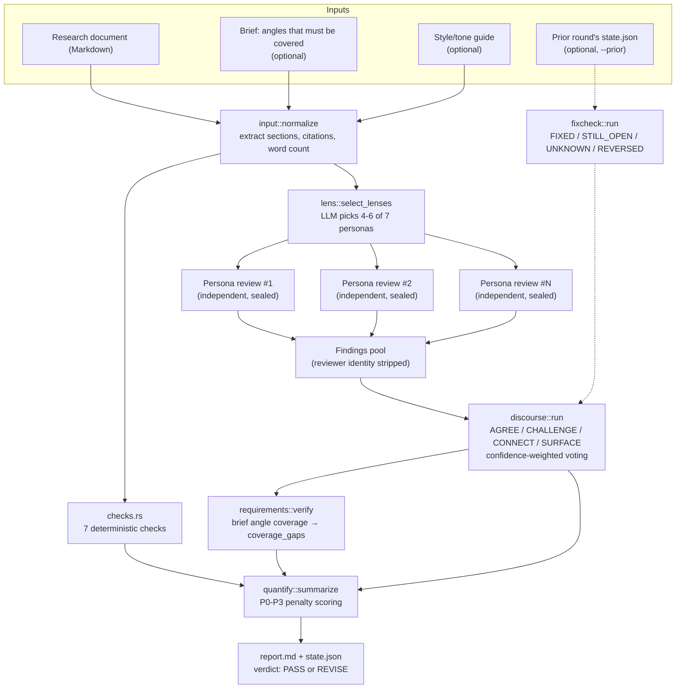
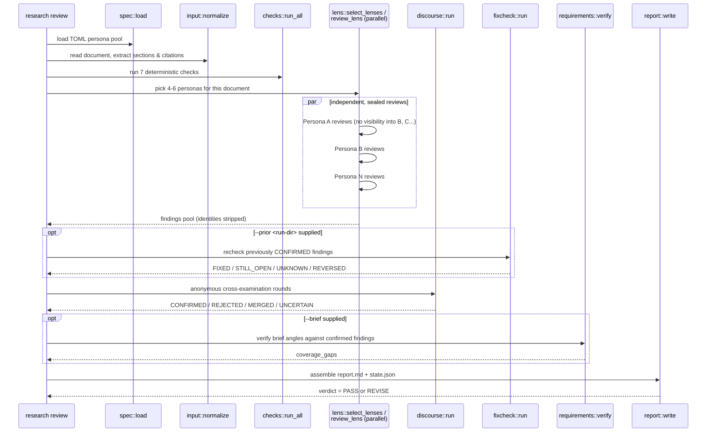
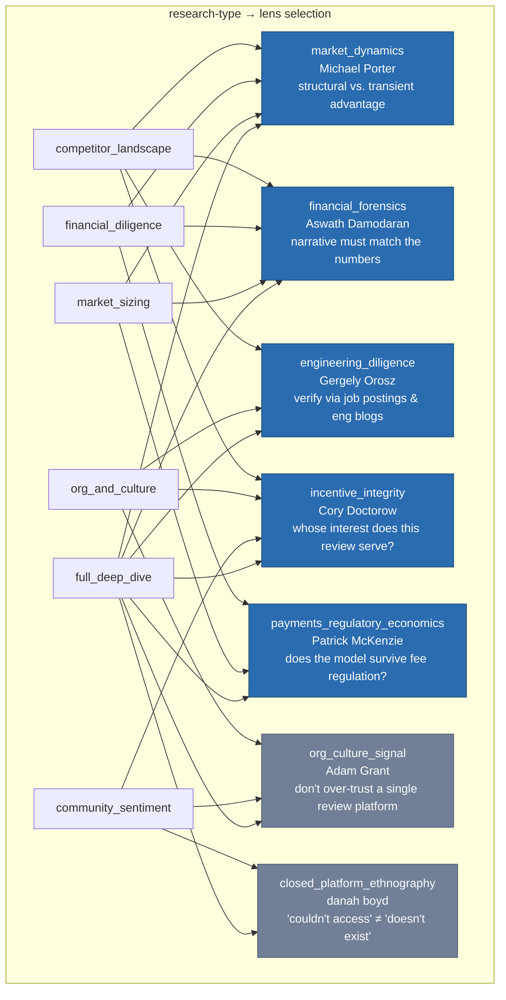
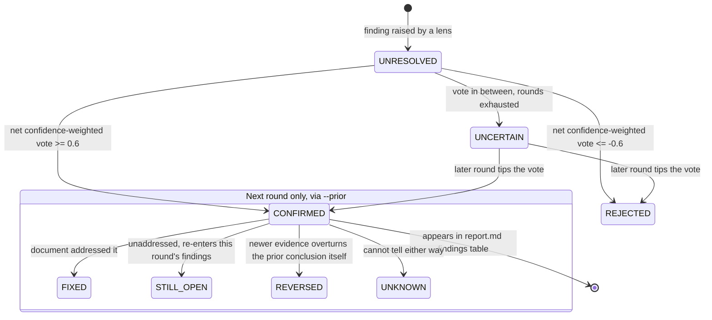
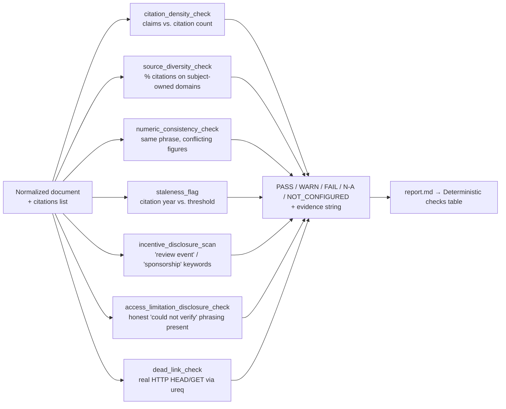

# research-loop

A Rust CLI that validates market/competitor research documents through **independent multi-persona review → discourse cross-examination → deterministic verdict**, instead of trusting a single LLM's pass over the text.

The LLM backend is a `claude -p` subprocess (Claude Code CLI) — same approach as [bizplan-loop](https://github.com/Loop-Suite/bizplan-loop). No separate API key required.

## Why this exists

This tool is the generalization of something that actually happened: across many rounds inside the MangroveCafeOrder project, a Korean café-POS competitor research document (5 companies: PayHere, Toss Place, NicePOS, T-order, CashNote) was researched, drafted, re-researched, and corrected over and over. That repeated cycle surfaced concrete failure modes that a single-pass research pipeline does not catch on its own:

- **Quantitative vs. qualitative signals disagreeing** — an app's star rating looked fine while long-form user reviews were scathing, and vice versa.
- **A subject's own marketing content dominating search results**, getting cited as if it were independent evidence.
- **Paid/incentivized reviews contaminating credibility** — one competitor was found to be running a "₩5,000 per review + ₩50,000 per referred install" cash program, meaning positive-sounding blog posts about it could not be taken at face value.
- **The same metric reappearing with different numbers across drafting rounds** (e.g., a competitor's user count cited as both 200K and 300K in different sections, sourced from different secondary articles).
- **A prior conclusion getting reversed by newer evidence** — a "acquisition talks denied" story from mid-2025 turned into a public IP-theft dispute and layoffs by early 2026, and the document had to explicitly mark that its own earlier verdict was overturned, not just updated.

None of these are caught by asking one model to "review this document" once. research-loop encodes the fix as a repeatable pipeline instead of manual vigilance.

> Design rationale, stage-by-stage: **[docs/design-spec.md](docs/design-spec.md)**
> Evidence survey (competitive-intelligence tooling landscape, citation-hallucination-detection adjacent research, and a source-code-level re-verification of several open-source "deep research" agents): **[docs/research-and-evidence-survey-2026-07-31.md](docs/research-and-evidence-survey-2026-07-31.md)**

## Architecture at a glance



## Requirements

- Rust 1.70+
- `claude` CLI installed and logged in (pass `--claude-bin` if it's not on `PATH`)

## Build

```bash
cargo build --release   # binary at target/release/research
```

## Subcommands

```bash
# 1) Independent per-persona review + discourse cross-examination (the core pipeline)
research --model sonnet --cheap-model haiku review \
  --spec specs/default.toml --document my-research.md \
  --brief brief.md --out runs/pos

# 2) Summarize the document (key findings, labels, splittability) + scan for "needs verification" markers
research describe --spec specs/default.toml --document my-research.md --out runs/pos

# 3) Propose concrete revisions (things to re-research or correct)
research improve --spec specs/default.toml --document my-research.md --out runs/pos

# 4) Free-form Q&A grounded in the document, appended to ask.md
research ask --spec specs/default.toml --document my-research.md --out runs/pos \
  "Did this company obtain PCI-DSS certification?"
```

## Execution flow of a `review` run



## Persona pool (7 lenses)

Each lens is voiced by a real analyst/author to suppress sycophancy — the model is told *who* it is arguing as, not just given a topic.



## Discourse: how findings get confirmed or rejected

Reviewer identity is deliberately stripped before the discourse round — knowing *which* persona raised a finding can make agreement about authority rather than evidence.



`REVERSED` is a research-loop addition that codereview-loop's fixcheck doesn't have — it exists specifically for the "prior conclusion overturned by newer evidence" failure mode (the acquisition-talks-to-IP-dispute example above). `STILL_OPEN` and `REVERSED` both re-enter the current round's findings; only `FIXED` and `UNKNOWN` drop out.

Valid `CHALLENGE` moves are also narrower than in codereview-loop: a challenge only counts if it **re-measures the same metric via a different method or an independent source** and finds a discrepancy. A challenge like "this feels outdated" with no counter-evidence is downgraded to `SURFACE` instead of counting toward the required per-round challenge.

## Deterministic checks (`checks.rs`)

codereview-loop splits this into `policy.rs` + `semgrep.rs`. Research documents have no equivalent of an "auto-fill everything" scanner like semgrep, so there was no reason to keep two modules — they're merged into one.



| check | what it does |
|---|---|
| `citation_density_check` | claim-sentence count vs. citation count |
| `source_diversity_check` | share of citations pointing at domains the research *subject* itself owns |
| `numeric_consistency_check` | flags the same short phrase appearing with different numbers in different sections (heuristic, WARN only) |
| `staleness_flag` | flags citation years older than a configurable threshold |
| `incentive_disclosure_scan` | flags "review event / sponsorship / cash reward" language for downstream discourse review |
| `access_limitation_disclosure_check` | checks the document actually says "could not verify" somewhere, rather than staying silent about access limits |
| `dead_link_check` | makes a real HTTP request (via `ureq`) per citation URL; timeouts are `WARN`, not `FAIL` — "unreachable" and "dead" are kept distinct. Skippable with `--skip-link-check` |

## Validated on a real 510-line document

Before shipping, this was run against the actual research document that motivated it (MangroveCafeOrder's POS-competitor research, 510 lines, 97 citations):

- `describe` correctly extracted 10 key findings, all 15 sections, and 1 real "needs verification" marker.
- `review` (2 lenses: `financial_forensics`, `incentive_integrity`) produced `verdict=PASS score=95/100`, and along the way:
  - `numeric_consistency_check` actually caught 8 conflicting figures behind the phrase "operating loss" (₩15.5B / ₩18.6B / ₩49.01B / ₩74.59B / ₩12.8B — each figure was correct for a *different* company/round, but the check correctly flagged that they needed disambiguating).
  - the discourse round surfaced an unverified estimate ("Toss Place: 300K installed stores") that the company's own official figure put at 200K — something a frequency-based "most-repeated-figure-wins" approach (see below) would have missed, since several secondary articles had already repeated the higher, unofficial number.

## It was checked against real open-source competitors, at the source-code level

The evidence survey didn't stop at README pages. Reading actual source files in `assafelovic/gpt-researcher`, `guy-hartstein/company-research-agent`, and `geekan/MetaGPT` corrected one of the survey's own earlier claims: GPT Researcher's README implies "most-frequent-info-wins" voting, but its actual `curator.py` does vector-similarity filtering plus a single LLM ranking pass — no contradiction detection either way. `company-research-agent` (2026, LangGraph + Gemini 2.5 + GPT-5.1, solving the *exact same problem* as research-loop) turned out to be a strictly sequential 6-node pipeline with zero cross-validation anywhere in its source. Full writeup, including the self-correction: [docs/research-and-evidence-survey-2026-07-31.md §8](docs/research-and-evidence-survey-2026-07-31.md).

## Limitations & assumptions

- LLM scoring is not ground-truth fact-checking — it's structured qualitative judgment. `citation_status` (`VERIFIED`/`UNVERIFIED`/`STALE`/`CONTRADICTED`) currently depends entirely on a persona's judgment during the discourse round; CITETRACER-style cascading automatic verification (cache → URL fetch → connector → web search) is not implemented (see docs §7).
- `numeric_consistency_check` uses a word-window regex, not real morphological/entity parsing — expect false positives/negatives. It's `WARN`-only for exactly this reason, never `FAIL`.
- If the generation model and the judge model are the same, it tends to rate its own writing style more favorably. Unlike bizplan-loop, research-loop doesn't yet warn when `--cheap-model` is left unset — worth adding.
- There is no human-voice rewrite stage. Research documents aren't being rewritten for tone, so that codereview-loop stage was dropped entirely rather than adapted (see docs §0).
- `FacTool`'s tool-augmented verification (execute code / re-run math / fetch and diff the actual source) is a promising direction not yet implemented — right now, numeric claims are only checked by an LLM persona's judgment, not by actually re-fetching the cited page and diffing the number against it.

## Lineage

Architecture origin: Code-Review-Loop (`Loop-Suite/codereview-loop`) — independent persona review, anonymized discourse, deterministic verdict. research-loop follows the same porting methodology as `marketing-loop`.
